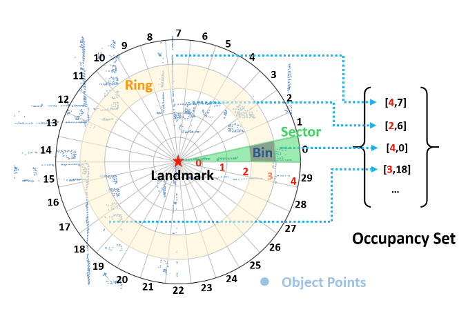
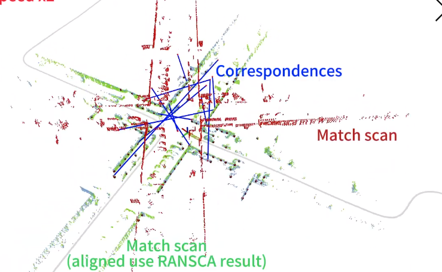

# Occupancy Set Key(OSK)

Occupancy set key is a LiDAR based place recognition algorithm had been accepted by IEEE TIM. 

demo video: https://www.youtube.com/watch?v=4yEeCB2dhWg



## Feature

1. Introducing set based location descriptor, and using locality sensitive hashing trick, we convert the 3D environment around the landmark into several unique hash values.
2. A simple but effective landmark selection strategy and by using RANSAC, algorithm can provide approximate 3DoF pose

## How to use

### Run on KITTI

We use point cloud download from [Semantic KITTI](http://www.semantic-kitti.org/dataset.html)

**Download Data**: [LiDAR](http://www.cvlibs.net/download.php?file=data_odometry_velodyne.zip), [calib&time](http://www.cvlibs.net/download.php?file=data_odometry_calib.zip), [pose](http://www.semantic-kitti.org/assets/data_odometry_labels.zip)

1. In **script/gt_kitti.py**, set four path:`lidar_folder_path`(lidar .bin file's folder), `timestamp_path`, `calib_cam_to_velo_path`, `cam0_to_world_path` according to the dataset's path on your computer. Then create a folder and assign its path to `output_folder_path`. 

   After these change run this python script, you will get some output file under `output_folder_path` including a **xxx/out.txt**, please copy the complete path of **xxx/out.txt** .

2. In **launch/run_osk.launch**, set the `lidar_info_path` using **xxx/out.txt**  generated before, and set the `result_save_path` using an arbritrary  **xxx.txt** file path:

   ```
   <param name="lidar_info_path" type="string" value="xxx/out.txt" />
   <param name="result_save_path" type="string" value="xxx.txt" />
   ```

3. in `shell/ folder ` run `./run.sh`. The result will be saved in `result_save_path`

### Run On KITTI360

Official website of [KITTI360](https://www.cvlibs.net/datasets/kitti-360/). Please download `Raw Velodyne Scans`, `Calibrations` and `Vechicle Poses`

1. The only difference with Run on KITTI is step 1, Please use `script/gt_kitti360.py` and set the four path according to your dataset's path.

### Evaluation

You can evaluate the performance(such as Precision-Recall) using the python script:

In `script/evaluation.py`, set the `file_gt_sens_poses` using **xxx/out.txt** and set `file_outcome_osk` using the `result_save_path` then run this python script.